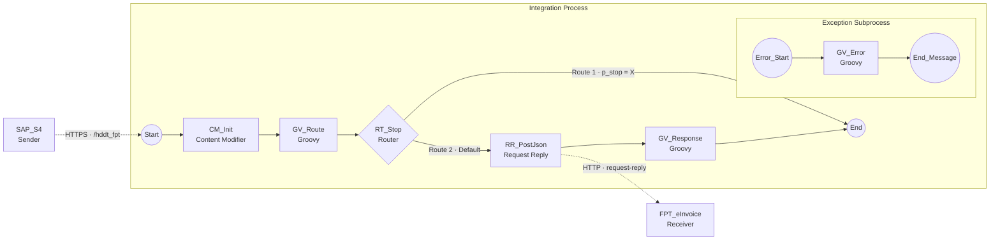

# 13 — Đưa luồng qua CPI: SAP → Integration Suite → FPT eInvoice

Package CPI: `MAG_Global_EInvoicing`. iFlow dựng ở đây làm **proxy mỏng**: ABAP
đã dựng đúng payload FPT rồi (`ZCL_HDDT_PROV_FPT`), nên iFlow không mapping,
chỉ chuyển tiếp và thêm log, chứng chỉ, IP egress cố định, retry.

Bật hay tắt CPI là việc **cấu hình, không sửa code**: chỉ đổi `ZTB_HDDT_CONN`
và `ZTB_HDDT_ACT`.

## 1. Cách ABAP gọi CPI

`ZCL_HDDT_HTTP` dựng URL theo hai đường:

| Cách khai `ZTB_HDDT_CONN` | URL cuối |
|---|---|
| `RFCDEST` (khuyến nghị) | destination cấp host + xác thực, path lấy từ `ZTB_HDDT_ACT-API_PATH` đặt vào pseudo-header `~request_uri` |
| `BASE_URL` | `BASE_URL` + `API_PATH` |

**Mã nghiệp vụ phải đi bằng query parameter, không đi bằng sub-path.** Sender
HTTPS của CPI có tenant không nhận sub-path: gọi `/<urlPath>/create-invoice` ra
404 và `CamelHttpPath` luôn rỗng. Vì vậy `API_PATH` khai dạng:

| ACTION | Method | API_PATH khi đi qua CPI |
|---|---|---|
| `CREATE_INVOICE` | POST | `/http/hddt_fpt?api=create-appr-inv` |
| `CREATE_DRAFT` | POST | `/http/hddt_fpt?api=create-invoice` |
| `UPDATE_INVOICE` | POST | `/http/hddt_fpt?api=update-invoice` |
| `ISSUE_INVOICE` | POST | `/http/hddt_fpt?api=issue-invoice` |
| `APPROVE_INVOICE` | POST | `/http/hddt_fpt?api=apprs` |
| `REPLACE_INVOICE` | POST | `/http/hddt_fpt?api=replace-invoice` |
| `ADJUST_INVOICE` | POST | `/http/hddt_fpt?api=adjust-invoice` |
| `CANCEL_INVOICE` | POST | `/http/hddt_fpt?api=cancel-invoice` |
| `DELETE_INVOICE` | POST | `/http/hddt_fpt?api=del-invoice` |
| `WRONG_NOTICE` | POST | `/http/hddt_fpt?api=create-wno-list` |
| `SEARCH_INVOICE` | **GET** | `/http/hddt_fpt?api=search-invoice` |
| `GET_FILE` | **GET** | `/http/hddt_fpt?api=search-invoice` |

Đủ 12 dòng, thiếu dòng nào thì nghiệp vụ đó gọi vào CPI ra 400. `LOGIN`
(`/c_signin`) **không** cần đổi: `AUTH_MODE = N` nên engine không gọi lấy token.

Hai dòng cuối là **GET** và FPT nhận tham số tra cứu trong **HTTP header**
(`stax`, `form`, `serial`, `seq`, `sid`, `type`, và các tham số caller truyền
thêm như `fd`, `td`, `btax`). Hai điều này buộc iFlow phải giữ nguyên method và
cho header lạ đi qua — xem Step 2b, Step 4 và Step 7.

Nếu tenant của bạn nhận sub-path thì dùng `/http/hddt_fpt/create-invoice` cũng
được, nhưng phải thử trước một lần.

## 2. Dựng iFlow — 7 step

### Sơ đồ iFlow



Bản vẽ đúng theo cách canvas sắp chỗ: Exception Subprocess nằm **trong** khung
Integration Process nhưng **không có mũi tên** nối vào luồng chính, và `Route 1`
vòng dưới về đúng element `End` của luồng chính.

Đọc ở editor không dựng được mermaid thì xem bản chữ:

```
 SAP_S4 ....HTTPS..>  Start
                        |
                     CM_Init         property p_fpt_base = {{FPT_BaseURL}}
                        |
                     GV_Route        đọc ?api, dựng CamelHttpUri
                        |
                     RT_Stop  --Route 2 (Default)-->  RR_PostJson ....HTTP..> FPT_eInvoice
                        |                                  |
                        |                             GV_Response      giữ nguyên JSON của FPT
                        |                                  |
                        +--------Route 1 (p_stop = X)--->  End          trả response về ABAP

 [Exception Subprocess]   Error_Start --> GV_Error --> End_Message      HTTP 502
```

| Element trên canvas | Loại | Việc |
|---|---|---|
| `SAP_S4` | Participant Sender | nơi ABAP gọi vào, adapter HTTPS `/hddt_fpt` |
| `Start` | Start event | nhận request từ ABAP |
| `CM_Init` | Content Modifier | đặt property `p_fpt_base` = `{{FPT_BaseURL}}` |
| `GV_Route` | Groovy | đọc `?api`, chặn mã lạ, dựng `CamelHttpUri` |
| `RT_Stop` | Router | tách nhánh lỗi 400 khỏi nhánh gọi FPT |
| `RR_PostJson` | Request Reply | gọi FPT và chờ response |
| `FPT_eInvoice` | Participant Receiver | adapter HTTP tới FPT |
| `GV_Response` | Groovy | giữ nguyên thân JSON, giữ mã HTTP của FPT |
| `End` | End event | trả response về ABAP |
| `Error_Start` | Error Start event | bắt lỗi ở bất kỳ step nào |
| `GV_Error` | Groovy | ghi MPL, dựng thân lỗi, đặt mã 502 |
| `End_Message` | End Message event | trả thân lỗi về ABAP |

Design → Integrations and APIs → `MAG_Global_EInvoicing` → Edit → Add →
Integration Flow, tên `HDDT_FPT_Proxy`.

### Step 1 — Sender

```
Participant Sender (không dấu cách trong tên) → nối message flow vào Start
Adapter: HTTPS
  Address        : /hddt_fpt          ← path endpoint CPI, KHÔNG phải URL của FPT
  Authorization  : User Role
  User Role      : ESBMessaging.send
  CSRF Protected : bỏ tick
```

Start event còn hiện tam giác cam là do thiếu Address hoặc chưa nối message flow.

### Step 2a — Content Modifier `CM_Init`

Bắt buộc, đứng ngay sau Start. Tab **Exchange Property** thêm một dòng:

```
Name   : p_fpt_base
Source Type : Constant
Value  : {{FPT_BaseURL}}
```

Không có step này thì `GV_Route` đọc `p_fpt_base` ra null và `CamelHttpUri`
thành `null/create-invoice`.

`{{FPT_BaseURL}}` là externalized parameter. Giá trị UAT
`https://api-uat.einvoice.fpt.com.vn`, **không có dấu gạch chéo ở cuối** vì
`GV_Route` tự ghép `base + '/' + api`.

### Step 2b — Groovy `GV_Route`

Đọc `api` từ query, kiểm tra nằm trong danh sách cho phép, rồi dựng URL đích.
Dùng `CamelHttpUri` vì ô Address của receiver không nhận `${property}`.

```groovy
import com.sap.gateway.ip.core.customdev.util.Message
import groovy.json.JsonOutput

def Message processData(Message message) {
    def query = message.getHeaders().get('CamelHttpQuery') ?: ''
    def api = ''
    query.split('&').each { p ->
        def kv = p.split('=')
        if (kv.length == 2 && kv[0] == 'api') { api = kv[1] }
    }

    def allowed = ['create-invoice', 'create-appr-inv', 'update-invoice',
                   'issue-invoice', 'apprs', 'replace-invoice',
                   'adjust-invoice', 'cancel-invoice', 'del-invoice',
                   'create-wno-list', 'search-invoice']
    if (!allowed.contains(api)) {
        message.setHeader('CamelHttpResponseCode', 400)
        message.setHeader('Content-Type', 'application/json')
        message.setBody(JsonOutput.toJson([ error: 'api khong hop le', api: api ]))
        message.setProperty('p_stop', 'X')
        return message
    }

    def base = message.getProperty('p_fpt_base')      // {{FPT_BaseURL}}
    message.setHeader('CamelHttpUri', base + '/' + api)

    // search-invoice / get_file la GET: giu nguyen method cua ABAP,
    // receiver phai de Method = Dynamic
    def m = message.getHeaders().get('CamelHttpMethod')
    message.setHeader('CamelHttpMethod', (m == null) ? 'POST' : m.toString())

    message.setProperty('p_api', api)
    return message
}
```

Không dùng ký tự escape trong `.groovy`: mất một dấu gạch chéo khi copy là cả
script không compile. Tránh regex, dùng `split`, `indexOf`, `substring`.

`p_fpt_base` lấy từ Content Modifier đứng trước, gán từ externalized param
`{{FPT_BaseURL}}` (giá trị UAT `https://api-uat.einvoice.fpt.com.vn`).

### Step 3 — Router `RT_Stop`

Hai nhánh, Expression Type **Non-XML** cho mọi nhánh dùng `${property}`:

```
Nhánh đi tiếp Request Reply : tick Default Route, để trống Condition
Nhánh đi End Message (400)  : ${property.p_stop} = 'X', KHÔNG tick Default
```

Canvas tự đặt tên `Route 1` / `Route 2` theo thứ tự vẽ, không theo thứ tự trên,
nên phải mở từng nhánh xem nó nối vào đâu rồi mới điền. Đặt điều kiện
`p_stop = 'X'` lên nhánh đi Request Reply là lộn ngược: mọi request hợp lệ rơi
vào nhánh mặc định trả 400, còn request sai `api` lại được gửi sang FPT.

Đúng một nhánh được tick Default Route. Không nhánh nào tick thì request không
khớp điều kiện sẽ ra `IllegalStateException: no default route`.

Để Expression Type là XML sẽ ra `XPathException: expected "<name>", found "{"`
vì body là JSON.

### Step 4 — Request Reply → Receiver `FPT_eInvoice`

```
Adapter: HTTP
  Address                    : {{FPT_BaseURL}}     ← bị CamelHttpUri ghi đè
  Query                      : để trống
  Proxy Type                 : Internet
  Method                     : Dynamic
  Expression                 : ${header.CamelHttpMethod}   ← bắt buộc khi Dynamic
  Send Body                  : TICK       ← không tick là POST gửi thân rỗng
  Content-Type               : application/json
  Request Headers            : Content-Type,stax,form,serial,seq,sid,type,fd,td,btax
  Response Headers           : Content-Type
  Authentication             : None       ← FPT nhận tài khoản trong thân payload
  Timeout                    : 45000      ← phải NHỎ HƠN TIMEOUT của ZTB_HDDT_CONN
  Throw Exception on Failure : BỎ TICK
```

`Timeout` của receiver phải nhỏ hơn `TIMEOUT` khai trong `ZTB_HDDT_CONN` (mặc
định 60 giây). Nếu để bằng hoặc lớn hơn thì khi FPT treo, phía SAP đứt trước và
nhận lỗi ICM chung chung, mất luôn thân lỗi mà Exception Subprocess dựng.

`Response Headers` đặt `*` thì `Content-Length` và `Content-Encoding` của FPT
lọt vào message; sau khi Groovy đổi thân, hai header này sai độ dài. Chỉ cần
`Content-Type`.

Chọn `Method = Dynamic` thì adapter hiện thêm hai ô:

* `Expression` — bắt buộc, viền đỏ khi trống. Điền đúng
  `${header.CamelHttpMethod}`, tức header mà `GV_Route` đã đặt. Không phải
  externalized param nên không dùng dấu ngoặc nhọn đôi.
* `Send Body` — mặc định **không tick**, vì ô này sinh ra cho trường hợp GET.
  Để nguyên là mọi lệnh POST phát hành hoá đơn gửi thân rỗng và FPT báo thiếu
  tham số. Phải tick. ABAP không gửi thân cho GET nên nhánh GET chỉ mang
  `Content-Length: 0`, vô hại.

`Authentication` phải là `None`. Chọn `Client Certificate` là adapter đi tìm
keystore alias để trình chứng chỉ client, FPT không yêu cầu và cũng không có
alias nào để trình; tài khoản FPT nằm trong thân payload ở nút `user`.

Bật `Throw Exception on Failure` thì lỗi từ FPT thành exception, client nhận
`500 ... The MPL ID for the failed message is ...` và mất nội dung lỗi thật.

`Authentication = Basic` sẽ ghi đè header `Authorization`; để `None` khi hệ đích
tự lo xác thực.

Để `Method = POST` cứng thì `SEARCH_INVOICE` và `GET_FILE` bị đổi từ GET sang
POST, FPT trả lỗi method. `Dynamic` đọc header `CamelHttpMethod` mà `GV_Route`
đã đặt.

[Unverified] Nếu bản adapter trên tenant không có mục `Dynamic` trong dropdown
`Method` thì làm cách hai: thêm nhánh thứ ba vào `RT_Stop` với điều kiện
`${property.p_api} = 'search-invoice'`, nhánh đó đi một Request Reply riêng
`RR_GetJson` để `Method = GET`, rồi nhập lại vào `GV_Response`. Tốn một
element nhưng không phụ thuộc phiên bản adapter.

ABAP không gửi thân cho GET (`ZCL_HDDT_HTTP~send` bỏ `set_cdata` khi method là
`GET` hoặc `DELETE`), nên body rỗng là đúng, đừng đi tìm payload trong Trace.

`Request Headers` **không nên có `Authorization`**. Tài khoản FPT nằm trong thân
payload ở nút `user` (xem `ZCL_HDDT_PROV_FPT~add_user_node`), còn header
`Authorization` mà CPI nhận được là Basic `clientid:clientsecret` của
destination SM59. [Inference] Liệt kê `Authorization` ở đây là chuyển tiếp
chính bí mật đó sang FPT — dựa trên cách CPI lọc header, chưa kiểm trên tenant
MAG. Chỉ khai lại khi nào chuyển sang provider dùng bearer token.

Sáu header `stax` `form` `serial` `seq` `sid` `type` là tham số tra cứu của
`search-invoice`; thiếu chúng thì FPT trả rỗng chứ không báo lỗi, rất dễ tưởng
là không có dữ liệu.

### Step 5 — Groovy `GV_Response`

Chuyển nguyên văn response về ABAP, giữ mã HTTP của FPT:

```groovy
import com.sap.gateway.ip.core.customdev.util.Message

def Message processData(Message message) {
    def code = message.getHeaders().get('CamelHttpResponseCode')
    if (code == null) { code = 200 }
    message.setHeader('CamelHttpResponseCode', code)
    message.setHeader('Content-Type', 'application/json')
    return message
}
```

Engine HĐĐT tự bóc response bằng `ZCL_HDDT_PROV_FPT~parse_response`, nên iFlow
tuyệt đối **không đổi cấu trúc JSON**.

### Step 6 — Exception Subprocess

Ba element, không nối vào Integration Process: `Error_Start` → Groovy `GV_Error`
→ `End_Message`. Runtime tự nhảy vào đây khi có lỗi ở bất kỳ step nào.

```groovy
import com.sap.gateway.ip.core.customdev.util.Message
import groovy.json.JsonOutput

def Message processData(Message message) {

    def ex  = message.getProperty('CamelExceptionCaught')
    def api = message.getProperty('p_api')
    def txt = (ex == null) ? 'khong ro nguyen nhan' : ex.toString()
    def apiTxt = (api == null) ? '' : api.toString()

    // Ghi vào Message Processing Log để tra bằng Monitor
    def log = messageLogFactory.getMessageLog(message)
    if (log != null) {
        log.setStringProperty('HDDT_api', apiTxt)
        log.setStringProperty('HDDT_error', txt)
        log.addAttachmentAsString('HDDT_error', txt, 'text/plain')
    }

    // JsonOutput tự escape nên không cần ký tự thoát trong script
    def body = JsonOutput.toJson([ error : 'CPI loi khi goi FPT',
                                   api   : apiTxt,
                                   detail: txt ])

    message.setBody(body)
    message.setHeader('Content-Type', 'application/json')
    message.setHeader('CamelHttpResponseCode', 502)
    return message
}
```

`messageLogFactory` là binding có sẵn của CPI, không phải import. `log` trả về
null khi log level là None, nên phải kiểm tra trước khi dùng.

Engine HĐĐT đọc mã 502 là lỗi kỹ thuật và ghi `ZTB_HDDT_LOG` với
`SUCCESS = space`; nội dung `detail` vào `RES_BODY` nên tra được nguyên nhân
ngay trên SAP mà không cần mở Monitor.

### Step 7 — Runtime Configuration

```
Allowed Header(s) : Content-Type,Accept,stax,form,serial,seq,sid,type,fd,td,btax
```

Thiếu dòng này thì header không tới được receiver. Sáu header giữa là tham số
của `search-invoice`, ba header cuối là tham số tra cứu tuỳ chọn.

Không cần `Authorization` cho luồng FPT — lý do ở Step 4.

Ô này nhận **danh sách tên header**, không phải tham số. Đừng đặt
`{{FPT_BaseURL}}` vào đây: base URL thuộc ô **Address của adapter HTTP** ở
receiver và property `p_fpt_base` trong `CM_Init`. Externalization chỉ liệt kê
tham số nào đang được tham chiếu, nên khai ở adapter trước rồi mới sửa ô này.

Save → Deploy. Trạng thái thật xem ở **Monitor → Manage Integration Content**,
không tin tab Deployment Status của bản draft đang mở.

## 3. Cấu hình phía SAP

```
1. STRUST → SSL client (Anonymous) → import chứng chỉ của host CPI + chain CA
   → Save → SMICM restart ICM (Exit Soft, Global)

2. SM59 → Connection type G → ZHDDT_CPI
     Target host : mag-sub-dev-....hana.ondemand.com
     Service No. : 443
     Path prefix : để trống
     Logon & Security: SSL Active, SSL Certificate = DFAULT
                       Basic Authentication, user = clientid, password = clientsecret
                       (service key của instance Process Integration Runtime)

3. ZFI002 → ZTB_HDDT_CONN → thêm dòng
     PROVIDER FPT · CONNID CPI · RFCDEST ZHDDT_CPI · AUTH_MODE N
     TOKEN_TTL 3000 · TIMEOUT 60 · XACTIVE X

4. ZFI002 → ZTB_HDDT_CRED → đổi CONNID của công ty sang CPI

5. ZFI002 → ZTB_HDDT_ACT → đổi API_PATH của provider FPT sang dạng
     /http/hddt_fpt?api=<mã nghiệp vụ>
```

**Không sửa một dòng ABAP nào.** `ZCL_HDDT_HTTP` đã có sẵn nhánh
`create_by_destination`: có `RFCDEST` thì nó mở destination và đặt path vào
pseudo-header `~request_uri`, nên query `?api=...` đi kèm được. Toàn bộ việc
chuyển sang CPI nằm ở ba bảng cấu hình cộng hai giao dịch hạ tầng.

### 3.1 Chi tiết từng bảng

`ZTB_HDDT_CONN` — thêm một dòng, giữ nguyên dòng `UAT` để còn đường quay lại:

| Cột | Giá trị | Ghi chú |
|---|---|---|
| `PROVIDER` / `CONNID` | `FPT` / `CPI` | khoá của dòng mới |
| `RFCDEST` | `ZHDDT_CPI` | có giá trị này thì `BASE_URL` bị bỏ qua |
| `BASE_URL` | để trống | |
| `AUTH_MODE` | `N` | destination tự gắn Basic; engine không gắn `Authorization` |
| `TOKEN_ACTION` | để trống | `AUTH_MODE = N` nên không có lượt gọi `c_signin` |
| `TIMEOUT` | `60` | phải **lớn hơn** Timeout của receiver trong iFlow |
| `SSL_ID` | để trống | chỉ dùng cho nhánh `BASE_URL`, destination tự lo SSL |
| `XACTIVE` | `X` | |

`ZTB_HDDT_CRED` — đổi `CONNID` của từng dòng công ty sang `CPI`. Giữ nguyên
`APIUSER` / `APISECRET`: tài khoản FPT vẫn đi trong thân payload ở nút `user`,
CPI không thay thế nó.

`ZTB_HDDT_ACT` — đổi `API_PATH` của 12 dòng provider `FPT` theo bảng ở mục 1.
Giữ nguyên `HTTP_METHOD`, kể cả hai dòng `GET`.

`ZTB_HDDT_PARM` — đổi `DEFAULT_CONNID` từ `UAT` sang `CPI`. `get_connection`
nhận `i_connid = ls_cred-connid`, chỉ khi ô đó trống mới lấy tham số này; đổi cả
hai chỗ để công ty khai sau mà quên điền `CONNID` vẫn đi CPI thay vì lặng lẽ gọi
FPT trực tiếp.

Riêng `FPT_USER_IN_BODY` phải để mặc định (khác `N`), nếu tắt thì payload mất
nút `user` và FPT từ chối. Các tham số còn lại không đổi.

### 3.2 Cái bẫy của ZTB_HDDT_ACT

Khoá của bảng là `MANDT + PROVIDER + ACTION`, **không có `CONNID`**. Nghĩa là
đổi `API_PATH` là đổi cho mọi công ty đang dùng provider `FPT` — không thể để
một công ty đi CPI còn công ty khác gọi FPT trực tiếp bằng cách chỉ đổi `CONNID`
trong `ZTB_HDDT_CRED`.

Muốn chạy song song thì tách provider: `ZTB_HDDT_PROV` thêm dòng `FPTCPI` với
`CLASSNAME = ZCL_HDDT_PROV_FPT`, rồi khai riêng bộ `ZTB_HDDT_ACT` và
`ZTB_HDDT_CONN` cho `FPTCPI`; `ZTB_HDDT_CRED` của từng công ty chọn provider
nào. Lưu ý `ZCL_HDDT_PROV_FPT` đọc tham số bằng hằng số `GC_PROVIDER = 'FPT'`,
nên `API_VERSION` vẫn tra dưới mã `FPT` — dùng chung tham số, đúng ý muốn.

### 3.3 Quay lại gọi FPT trực tiếp

Đổi `CONNID` trong `ZTB_HDDT_CRED` về `UAT` và trả `API_PATH` về dạng
`/create-appr-inv`, `/search-invoice`... Giữ hai bộ giá trị trong file để đổi
qua lại nhanh. Không cần undeploy iFlow, không cần transport.

Không lưu `clientsecret` trong bảng nào của package: nó nằm ở destination SM59.

## 4. Kiểm tra

1. Postman: `POST https://<cpi-host>/http/hddt_fpt?api=create-invoice`, Basic
   Auth bằng clientid/clientsecret, body là payload FPT thật. Phải nhận đúng
   response của FPT.
2. Postman riêng cho nhánh GET: `GET https://<cpi-host>/http/hddt_fpt?api=search-invoice`,
   **không có body**, thêm header `stax`, `form`, `serial`, `seq`, `sid`,
   `type: json`. Trả về đúng hoá đơn thì phần header đã đi xuyên được CPI; trả
   rỗng là Allowed Header(s) còn thiếu tên header.
3. `ZFI001` → chọn chứng từ → tick Test run → nút `Xem payload` để soát nội dung.
4. Bỏ tick Test run → `Tích hợp HĐ`. Xem `ZTB_HDDT_LOG` qua nút `Log`: `FULL_URL`
   phải trỏ CPI, `HTTP_CODE` và `RES_BODY` là của FPT.
5. Lỗi thì bật Trace: Manage Integration Content → iFlow → Log Configuration →
   Trace → gửi lại → Monitor Message Processing → message → Logs → Trace, xem
   Payload từng step. Trace tự hết sau 10 đến 15 phút.

## 5. Bẫy đã biết

| Triệu chứng | Nguyên nhân | Xử lý |
|---|---|---|
| Gọi sub-path ra 404, `CamelHttpPath` rỗng | Sender HTTPS không nhận sub-path | truyền mã nghiệp vụ bằng query `?api=` |
| Client nhận `500 ... MPL ID for the failed message` | Request Reply bật Throw Exception on Failure | bỏ tick, trả lỗi qua Router hoặc Groovy |
| `XPathException: expected "<name>", found "{"` | Router để Expression Type XML | đổi Non-XML |
| Receiver báo "You cannot configure dynamic parameters" | dùng `${property}` trong ô Address | dùng externalized `{{...}}` hoặc header `CamelHttpUri` |
| FPT trả 401 dù Groovy đã set header | ô `Request Headers` của adapter thiếu `Authorization` | điền `Content-Type,Authorization` |
| Groovy báo `unexpected char: \` | mất dấu gạch chéo khi copy | bỏ escape, dùng `split` / `indexOf` |
| Request hợp lệ cũng trả 400 `api khong hop le` | điều kiện `p_stop` đặt lên nhánh đi Request Reply | chuyển điều kiện sang nhánh đi End Message, nhánh còn lại tick Default Route |
| SAP báo timeout nhưng Monitor CPI vẫn `Processing` | `Timeout` receiver ≥ `TIMEOUT` của `ZTB_HDDT_CONN` | hạ Timeout receiver xuống dưới mốc của SAP |
| `search-invoice` qua CPI trả rỗng | Allowed Header(s) thiếu `stax,form,serial,seq,sid,type` | thêm đủ tên header ở Runtime Configuration và Request Headers của receiver |
| FPT báo sai method ở `search-invoice` | receiver để `Method = POST` cứng | đổi `Dynamic`, `GV_Route` đặt `CamelHttpMethod` |
| Một nghiệp vụ trả 400 `api khong hop le`, các nghiệp vụ khác chạy | mã đó thiếu trong danh sách `allowed` của `GV_Route` | đối chiếu đủ 11 mã ở Step 2b |
| Đổi API_PATH xong công ty khác cũng đi CPI | `ZTB_HDDT_ACT` không có cột `CONNID` | tách provider `FPTCPI`, xem mục 3.2 |
| Chọn Dynamic thì ô `Expression` viền đỏ | Dynamic bắt buộc có biểu thức lấy method | điền `${header.CamelHttpMethod}` |
| POST phát hành trả lỗi thiếu tham số, Trace thấy body rỗng ở receiver | `Send Body` không tick sau khi đổi sang Dynamic | tick `Send Body` |
| Deploy xong endpoint vẫn vào iFlow cũ | hai iFlow trùng `urlPath` | đổi Address của một bản trước khi deploy |
| `401 invalid_client` khi lấy token | lỗi client authentication, không phải grant hay scope | Basic Auth đúng cặp clientid/secret, body `x-www-form-urlencoded`, secret có `$` phải nháy đơn |
| `consumed the assigned subaccount quota for integration flows` | hết quota iFlow | undeploy iFlow khác hoặc xin tăng quota |

## 6. Chi phí và giới hạn

Ngưỡng tính phí một message là 250 KB. Payload hoá đơn nhiều dòng hàng nên đo
thử trước: hoá đơn 200 dòng khoảng vài chục KB, còn xa ngưỡng. File PDF trả về
từ `search-invoice` là base64 nên phình 4/3, file gốc chỉ được tới khoảng 187 KB
trước khi vượt ngưỡng.

[Unverified] Hướng dẫn dựa trên kinh nghiệm dự án SInvoice và cấu trúc code
trong repo, chưa dựng thật iFlow này trên tenant MAG. Ba chỗ cần thử đầu tiên:
sender có nhận sub-path hay không, tenant có lọc header hay không, và tên
externalized param sau khi Configure.
